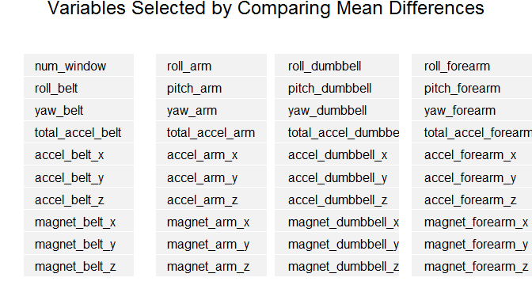
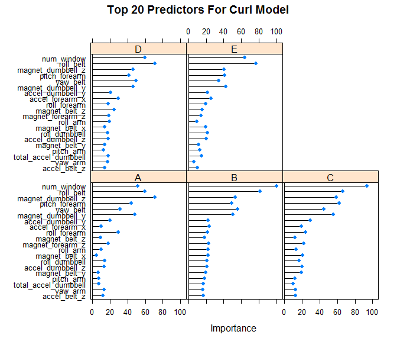
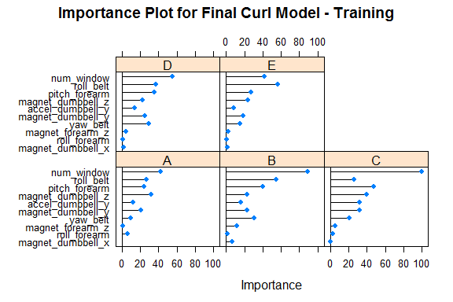
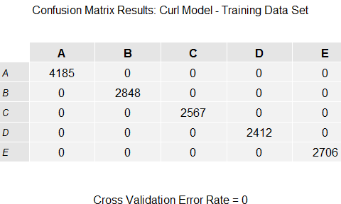

# Machine Learning Class Assignment
Edmund A. Marcarelli  
January 27, 2016  

### Executive Summary

The goal of this project is to predict the manner in which an exercise was done. The outcome  variable in the data set is *classe*.  This analysis examines the data and chooses variables to predict with. This report describes how I built the model, how I used cross validation, and what I think the expected out-of-sample error is. I describe what choices were made in pre-processing the data and how the model was chosen. 

### Preliminary data analysis and data tidying

The data set provided for the project involves Human Activity Recognition described here: http://groupware.les.inf.puc-rio.br/har.  It has **19622** observations and **160** variables.

The first step of this analysis is to split the data into training and test sets. Next examine the data set and do some initial tidying it up.  I looked for near-zero variables and variables with significant missing values (more than 10,000 observations).  All of these variables were dropped.  This left a data set with **14718** observations and **54** variables. I also dropped variables that won't be used in the analysis: *user_name, timestamps and new_window*.

Given the relatively large number of potential predictors some further analysis of the data is required before selecting features for the model.

### Data analysis and model selection

The variable *classe* indicates how an exercise was done.  "A" indicating a correct execution and all other values (B through E) indicating execution with various mistakes.  To help select predictors, I created a new outcome variable, *A_curl*, which is 1 for correct execution and 0 for incorrect.  I used this variable to do some of my preliminary analysis.  I separated the 1 and zeros and calculated means for each variable by group.  I then took the absolute value of the differences.  I set up a process that let me choose from these variables above a certain threshold in the differences. I selected all variables with a difference in means that put them at 75%  or above in the list of variables, then 50%, then 25% and fit each group to a *glm* model.  As expected each model gave progressively better results for accuracy, sensitivity and specificity as the number of variables increased.

This analysis identified **40**  variables in the 25 percentile and above that, using a *glm* model, provided for **90.3%** accuracy (see below).  

------

 

------
Next I reverted to *classe* as the outcome variable and used a *random forest* model with these variables.  This produced an even higher level of accuracy.  The results are described below.

 

The  *random forest* model reaches **100%** accuracy. The plot above shows the relative importance of the top 20 (of 40) variables in the model. It demonstrates that importance trails off significantly. Given this diminishing importance, and to minimize the risk of over-fitting, I decided to use just the top 10 variables in a new model. 

The new *random forest* model produced the Importance Plot below.  For this model I returned to the original training set (before any pre-processing had been done) and constructed a set of code that would be used to pre-process both the training and test sets. 

 

The model was run using K-fold cross-validation (k = 3). Somewhat surprisingly, drooping from 40 variables to 10 had little or no adverse affect on the model's accuracy. This model gives this level of accuracy: **100%**.  

 

### Results

The final step was to use the model to predict the test data set. The test data set was pre-processed with the identical code used to pre-process the training set.

Note: *This model run was only run once against the test data set. The code in the .Rmd file is set to eval=FALSE and the rsults are "hard-coded" in the report.*

The model indicates accuracy of **99.92%** and an expected out-of-sample error rate of **0.08%**.  This is based on the accuracy of the model when it was run against the test data set held out from the original data provided.

> Accuracy: 99.92%

> Expected Out-of-sample Error: 0.08%

### Conclusion

The curl exercise identified the correct way to execute the curl and several "mistakes."  This report demonstrates that the manner in which the exercise was executed can be identified reliably using 10 variables from the Human Activity Recognition data set that was the subject of this class project.  

.
.
.

      

##### End of report
